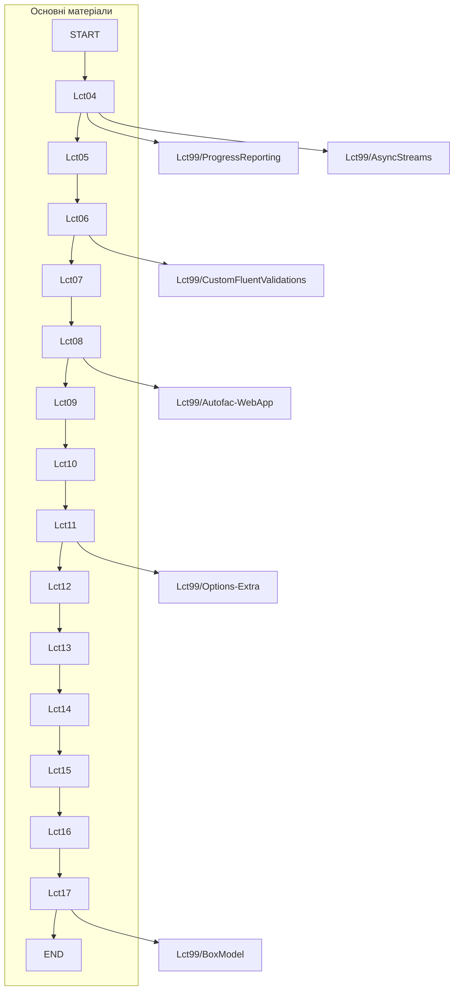

Приклади коду для дисципліни "Розроблення вебзастосунків", кафедра програмного забезпечення комп'ютерних систем КПІ імені Ігоря Сікорського, 2026-2027 н.р.

Рекомендований порядок вивчення:

```mermaid
flowchart TD

    subgraph V["Основні матеріали"]
        direction LR
        START --> Lct04 --> Lct05 --> Lct06 --> Lct07 --> Lct08 --> Lct09 --> Lct10 --> Lct11 --> Lct12 --> Lct13 --> Lct14 --> Lct15 --> Lct16 --> Lct17 --> END
    end

    Lct04 --> Lct99/ProgressReporting
    Lct04 --> Lct99/AsyncStreams
    Lct06 --> Lct99/CustomFluentValidations
    Lct08 --> Lct99/Autofac-WebApp
    Lct11 --> Lct99/Options-Extra
    Lct17 --> Lct99/BoxModel
```
